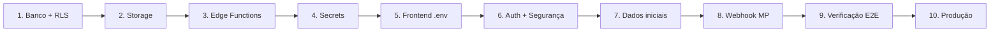

# Plano de Reimplementação Supabase — ChamaOLucca

**Projeto:** `wjkytzvgbvkcaqjrqsbu` (sa-east-1)  
**Objetivo:** Infraestrutura completa (banco, RLS, storage, edge functions, secrets, integração segura) compatível com o frontend React existente.

---

## Visão geral das etapas



| Etapa | Escopo | Agente | Status |
|-------|--------|--------|--------|
| **1** | Migrations SQL (16 tabelas, RLS, RPCs, triggers, Realtime) | **DB** | ✅ Concluída |
| **2** | Bucket `product-images` + policies | **DB** | ✅ Concluída |
| **3** | 8 Edge Functions deployadas | **Edge** | ✅ Concluída |
| **4** | Secrets `MP_ACCESS_TOKEN`, `GOOGLE_MAPS_API_KEY` | **Ops** | ✅ Concluída |
| **5** | `.env` + `.env.example` frontend | **Frontend** | ✅ Concluída |
| **6** | Auth seguro + hardening (role, cupom atômico) | **Security** | ✅ Concluída |
| **7** | Seed operacional (bairros IBGE, admin, catálogo) | **Ops** | 🔄 Catálogo demo + bairros OK; falta admin |
| **8** | Webhook Mercado Pago (`mp-webhook`) | **Edge** | ✅ Concluída |
| **9** | Checklist 18 itens + script `verify-supabase.mjs` | **QA** | 🔄 Em andamento |
| **10** | Auth URLs Dashboard + deploy produção | **Ops** | ⏳ Pendente |

---

## Divisão por agente

### Agente DB (banco de dados)
- Manter `supabase/migrations/*.sql` como fonte da verdade
- Aplicar via `node scripts/apply-supabase-schema.mjs`
- Responsável: RLS, triggers (`handle_new_user`), RPCs, seeds incrementais

### Agente Edge (serverless)
- Funções em `supabase/functions/`
- Deploy via `node scripts/deploy-edge-functions.mjs` ou `npx supabase functions deploy <nome>`
- Responsável: MP, Google Maps, `place-order`, futuro `mp-webhook`

### Agente Frontend (integração React)
- `.env`, `Checkout.jsx`, `AuthContext.jsx`, chamadas `supabase.functions.invoke`
- Nunca calcular totais/preços no cliente para persistência

### Agente Security (hardening)
- Itens 01–03 do `security-audit.md`
- Migration 003, remoção de upsert com `role` no signup

### Agente Ops (configuração manual + scripts)
- Promover admin, Auth redirect URLs, rotacionar secrets
- Scripts: `promote-admin.mjs`, `verify-supabase.mjs`

### Agente QA (validação)
- Executar checklist Fase 7 do `REIMPLEMENTACAO-PROMPT.md`
- Registrar falhas e abrir correções por etapa

---

## Etapa 1 — Banco + RLS ✅

**Arquivos:** `001_initial.sql`, `002_v2_alignment.sql`

Entregas:
- 16 tabelas, RLS em todas, 3 RPCs (`get_slot_availability`, `get_slot_exceptions_for_date`, `increment_coupon_use`)
- Trigger `handle_new_user` em `auth.users`
- Policy anti auto-promoção admin (002)
- Seeds: categorias, slots, settings, bairros incl. Jardim Petrolar

**Comando:**
```powershell
$env:SUPABASE_ACCESS_TOKEN = "sbp_..."
node scripts/apply-supabase-schema.mjs
```

---

## Etapa 2 — Storage ✅

Bucket `product-images` (público leitura, admin escrita) criado na migration 001.

---

## Etapa 3 — Edge Functions ✅

| Função | Uso |
|--------|-----|
| `create-mp-preference` | Checkout → Mercado Pago |
| `place-order` | Pedido server-side (segurança) |
| `geocode-address` | Admin geocodificação |
| `optimize-route` | Admin rotas |
| `places-autocomplete` | Checkout endereço |
| `place-details` | Checkout endereço |
| `reverse-geocode` | Checkout endereço |
| `fetch-neighborhoods` | Admin bairros via IBGE |

---

## Etapa 4 — Secrets ✅

No Dashboard → Edge Functions → Secrets:
- `MP_ACCESS_TOKEN`
- `GOOGLE_MAPS_API_KEY`

APIs Google ativas: Geocoding, Directions, Places.

---

## Etapa 5 — Frontend .env ✅

```
VITE_SUPABASE_URL=https://wjkytzvgbvkcaqjrqsbu.supabase.co
VITE_SUPABASE_ANON_KEY=...
```

---

## Etapa 6 — Auth + Segurança 🔄

### 6.1 Signup sem role no cliente
- [x] Trigger `handle_new_user` cria profile com `role = customer`
- [x] Remover `upsert` com `role` em `AuthContext.signUp`
- [x] RLS impede UPDATE de `role` por não-admin (002)

### 6.2 Cupom atômico
- [x] Migration `003_security_hardening.sql` — `increment_coupon_use` com guarda `max_uses`
- [x] `place-order` falha se incremento do cupom falhar

### 6.3 Reset de senha
- [x] `resetPasswordForEmail` com `redirectTo` → `/perfil`
- [ ] Página dedicada de nova senha (melhoria futura)
- [ ] Auth URLs no Dashboard (Site URL + Redirect URLs)

---

## Etapa 7 — Dados iniciais ⏳

1. Criar conta no app (signup)
2. Promover admin:
   ```sql
   UPDATE public.profiles SET role = 'admin' WHERE email = 'seu@email.com';
   ```
   Ou: `node scripts/promote-admin.mjs seu@email.com`
3. Admin → Configurações → **Buscar bairros** (`fetch-neighborhoods`)
4. Cadastrar produtos, categorias, cupons de teste

---

## Etapa 8 — Webhook Mercado Pago ⏳

**Por quê:** Hoje o pagamento depende do redirect + query `?mp_status=`. Webhook confirma `payment_status` de forma confiável.

**Entregas:**
- Edge Function `mp-webhook`
- `notification_url` em `create-mp-preference`
- Atualizar `orders.payment_status`, `payment_id`, `paid_at`

**Agente:** Edge

---

## Etapa 9 — Verificação ⏳

Script automatizado:
```powershell
node scripts/verify-supabase.mjs
```

Checklist manual (18 itens) — `REIMPLEMENTACAO-PROMPT.md` Fase 7:
- Signup/profile, login, loja, carrinho, checkout (endereço, slots, cupom, MP)
- Admin: pedidos, produtos, upload, categorias, motoristas, rotas, geocode, exceções, cupons, settings

---

## Etapa 10 — Produção ⏳

1. Dashboard → Authentication → URL Configuration:
   - Site URL: `https://seudominio.com.br`
   - Redirect URLs: `https://seudominio.com.br/**`, `http://localhost:5173/**`
2. Rotacionar secrets expostos em chats/logs
3. `npm run build` + deploy hosting
4. Teste checkout real (valor baixo) no MP produção

---

## Ordem de execução recomendada (hoje)

```
1. Aplicar migration 003          (Agente DB)
2. Corrigir AuthContext           (Agente Frontend + Security)
3. Rodar verify-supabase.mjs      (Agente QA)
4. Promover admin + seed bairros  (Agente Ops)
5. Testar checkout local          (Agente QA)
6. Implementar mp-webhook         (Agente Edge) — próxima sprint
```

---

## Comandos úteis

```powershell
# Schema
$env:SUPABASE_ACCESS_TOKEN = "sbp_..."
node scripts/apply-supabase-schema.mjs

# Edge Functions (todas)
node scripts/deploy-edge-functions.mjs

# Uma função
npx supabase functions deploy place-order --project-ref wjkytzvgbvkcaqjrqsbu --no-verify-jwt

# Verificação
node scripts/verify-supabase.mjs

# Promover admin
node scripts/promote-admin.mjs admin@chamaolucca.com.br
```

---

## Riscos conhecidos

| Risco | Mitigação |
|-------|-----------|
| Preço manipulado no cliente | ✅ `place-order` server-side |
| Escalada de role admin | ✅ Trigger + RLS 002 + signup sem role |
| Pagamento não confirmado sem redirect | ⏳ Etapa 8 webhook |
| MCP Supabase com erro no Cursor | Usar CLI + Management API |
| Secrets no histórico do chat | Rotacionar MP + Google + PAT |

---

*Última atualização: 11/06/2026*
